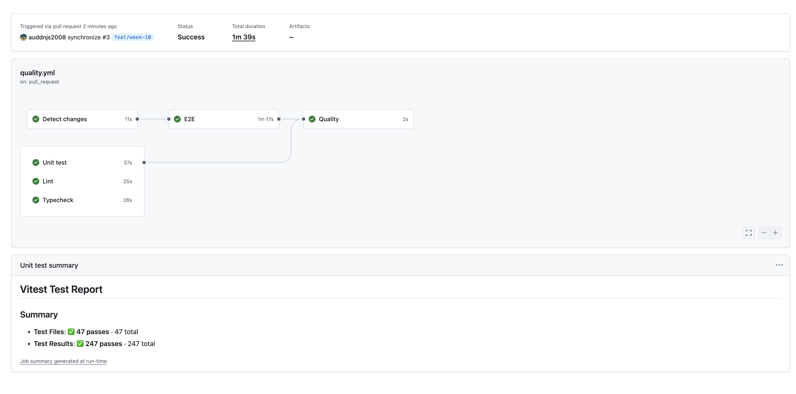
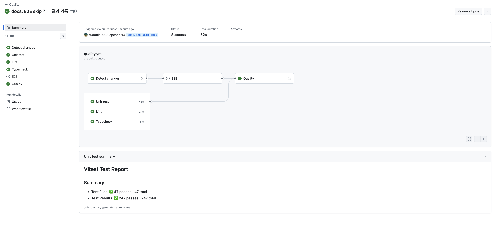
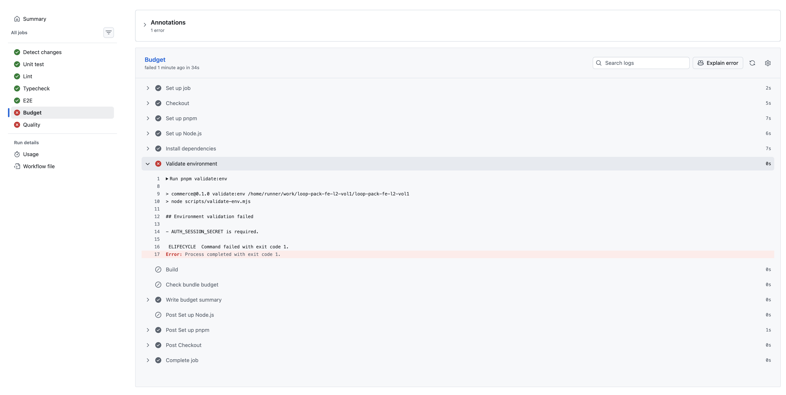
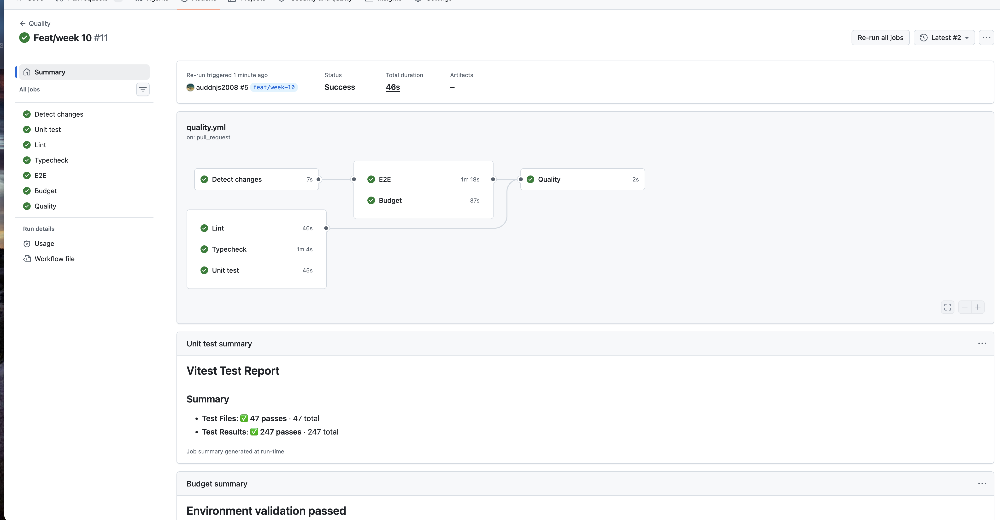
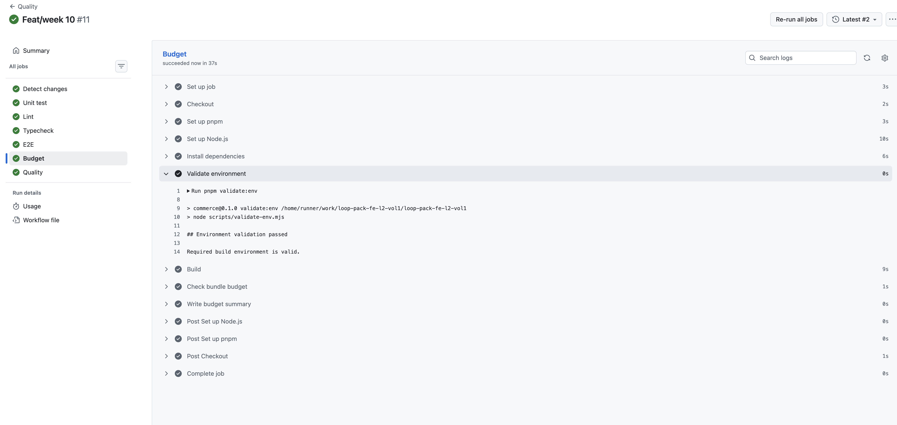

# 10주차 CI 측정 기록

## 1단계 - CI 파이프라인을 측정하고 병목만 줄이기

### Before 측정 조건

측정 대상은 기존 `Quality` workflow다. PR이 열리면 `quality` job 하나가 Ubuntu runner에서 실행되고, 의존성을 설치한 뒤 `pnpm check`를 실행한다.

- workflow: `.github/workflows/quality.yml`
- event: `pull_request`
- runner: `ubuntu-latest`
- Node.js: `.nvmrc` 기준 `24.17.0`
- package manager: `pnpm 10.15.1`
- install: `pnpm install --frozen-lockfile`
- 검증 명령: `pnpm check`
- 측정 커밋: `b3f34851 ci: quality job timeout 설정`

`pnpm check`는 `pnpm test && pnpm lint && pnpm typecheck && pnpm test:e2e`를 실행한다. `pnpm test:e2e` 내부에서 production build와 Playwright E2E가 함께 실행되므로, 현재 CI는 lint, typecheck, test, build, E2E를 모두 포함한다.

### Before Cold 측정

cold는 `Set up Node.js` step에 pnpm cache가 없다고 나온 실행으로 잡았다.

캐시 근거:

```txt
pnpm cache is not found
```

#### Cold Raw Data

| 구분       | Total duration | Quality job | Set up job | Checkout | Set up pnpm | Set up Node.js | Install dependencies | Install Playwright Chromium | Run quality checks | Post Set up Node.js |
| ---------- | -------------- | ----------- | ---------- | -------- | ----------- | -------------- | -------------------- | --------------------------- | ------------------ | ------------------- |
| cold try 1 | 1m 45s         | 1m 42s      | 1s         | 2s       | 3s          | 4s             | 6s                   | 23s                         | 56s                | 5s                  |
| cold try 2 | 1m 49s         | 1m 44s      | 2s         | 4s       | 8s          | 5s             | 9s                   | 25s                         | 44s                | 4s                  |
| cold try 3 | 1m 55s         | 1m 51s      | 1s         | 2s       | 4s          | 7s             | 7s                   | 23s                         | 59s                | 5s                  |

#### Cold Summary

| 항목           | Raw                 | Median | Range         |
| -------------- | ------------------- | ------ | ------------- |
| Total duration | 1m45s, 1m49s, 1m55s | 1m49s  | 1m45s ~ 1m55s |
| Quality job    | 1m42s, 1m44s, 1m51s | 1m44s  | 1m42s ~ 1m51s |
| Run quality    | 56s, 44s, 59s       | 56s    | 44s ~ 59s     |
| Playwright     | 23s, 25s, 23s       | 23s    | 23s ~ 25s     |
| Install deps   | 6s, 9s, 7s          | 7s     | 6s ~ 9s       |

### Before Warm 측정

warm은 `Set up Node.js` step에서 pnpm cache hit과 restore 로그가 나온 실행으로 잡았다.

캐시 근거:

```txt
Cache hit for: node-cache-Linux-x64-pnpm-...
Cache restored successfully
Cache restored from key: node-cache-Linux-x64-pnpm-...
```

#### Warm Raw Data

| 구분       | Total duration | Quality job | Set up job | Checkout | Set up pnpm | Set up Node.js | Install dependencies | Install Playwright Chromium | Run quality checks | Post Set up Node.js |
| ---------- | -------------- | ----------- | ---------- | -------- | ----------- | -------------- | -------------------- | --------------------------- | ------------------ | ------------------- |
| warm try 1 | 1m 50s         | 1m 45s      | 1s         | 1s       | 6s          | 8s             | 2s                   | 27s                         | 57s                | 0s                  |
| warm try 2 | 1m 47s         | 1m 41s      | 0s         | 2s       | 4s          | 8s             | 2s                   | 24s                         | 58s                | 0s                  |
| warm try 3 | 2m 06s         | 2m 00s      | 1s         | 2s       | 3s          | 12s            | 2s                   | 35s                         | 1m 00s             | 0s                  |

#### Warm Summary

| 항목           | Raw                 | Median | Range         |
| -------------- | ------------------- | ------ | ------------- |
| Total duration | 1m50s, 1m47s, 2m06s | 1m50s  | 1m47s ~ 2m06s |
| Quality job    | 1m45s, 1m41s, 2m00s | 1m45s  | 1m41s ~ 2m00s |
| Run quality    | 57s, 58s, 1m00s     | 58s    | 57s ~ 1m00s   |
| Playwright     | 27s, 24s, 35s       | 27s    | 24s ~ 35s     |
| Install deps   | 2s, 2s, 2s          | 2s     | 2s ~ 2s       |

### 병목 지점

가장 긴 step은 모든 실행에서 `Run quality checks`였다.

- cold: 56s, 44s, 59s
- warm: 57s, 58s, 1m00s

두 번째로 긴 step은 `Install Playwright Chromium when used`였다.

- cold: 23s, 25s, 23s
- warm: 27s, 24s, 35s

pnpm cache는 `Install dependencies` 시간을 줄이는 데 효과가 있었다. cold에서는 6~9초가 걸렸고, warm에서는 2초로 줄었다. 하지만 전체 wall-clock 중앙값은 cold 1m49s, warm 1m50s로 거의 차이가 없었다. 현재 병목은 의존성 설치보다 `pnpm check` 내부 검증과 Playwright Chromium 설치에 가깝다.

### Before 결론

현재 workflow는 lint, typecheck, test, build, E2E를 한 job에서 모두 실행한다. pnpm cache hit은 확인했지만, 전체 실행 시간에는 큰 영향을 주지 못했다. Before 기준에서 줄일 후보는 `Run quality checks` 내부를 쪼개 병렬화할 수 있는지, 또는 Playwright Chromium 설치를 E2E job으로 분리해 필요한 경우에만 실행할 수 있는지다.

다만 1단계 최적화에서는 검증을 제거하지 않고, 같은 검증을 유지한 채 병목만 줄여야 한다. 그래서 다음 변경 후보는 `lint`, `typecheck`, `unit test`, `build/e2e`를 독립 job으로 나누는 방식이다.

### 전략 선택

Before에서 지목한 병목은 `Run quality checks`였다. 이 step 안에서 `pnpm test`, `pnpm lint`, `pnpm typecheck`, `pnpm test:e2e`가 직렬로 실행되므로 1단계에서는 job 병렬화를 적용한다.

| 전략                       | 적용 여부 | 판단 근거                                                                                                                                               |
| -------------------------- | --------- | ------------------------------------------------------------------------------------------------------------------------------------------------------- |
| job 병렬화                 | 적용      | `Run quality checks`가 cold/warm 모두 최장 step이었다. 독립적인 검증을 job으로 나누면 같은 검증을 유지하면서 직렬 시간을 줄일 수 있다.                  |
| `concurrency` 그룹         | 제외      | 같은 PR에 연속 push가 쌓이는 문제를 줄이는 전략이다. 이번 Before 측정의 병목은 단일 실행 내부의 직렬 검증이므로 직접적인 wall-clock 개선 전략은 아니다. |
| setup-node/pnpm store 캐시 | 제외      | 이미 적용되어 있고 warm 실행에서 cache hit이 확인됐다. `Install dependencies`는 warm 기준 2초라 현재 병목이 아니다.                                     |
| path filter                | 제외      | 안 돌려도 되는 검증을 제외하는 조건부 실행 전략이므로 2단계에서 다룬다. 1단계에서는 돌리기로 한 검증을 더 빠르게 만드는 데 집중한다.                    |

job을 병렬화하면 각 job에서 `pnpm install --frozen-lockfile`이 반복된다. 다만 warm 기준 `Install dependencies` 중앙값이 2초였기 때문에 이 반복은 현재 wall-clock 병목으로 보지 않았다. 대신 `Install Playwright Chromium when used`는 24~35초로 상대적으로 크므로 E2E job에서만 실행하도록 분리한다.

`concurrency`를 나중에 적용한다면 main push 실행까지 취소하지 않도록 `group: ${{ github.workflow }}-${{ github.ref }}`처럼 ref를 포함해야 한다.

### 캐시 hit 자가 검증

캐시가 실제로 hit 되는지 확인하려고 정상 lockfile 상태와 lockfile hash를 일부러 바꾼 상태를 각각 실행했다.

#### Warm hit 확인

정상 lockfile 상태의 warm 실행에서는 `Set up Node.js` step에 pnpm store cache 복원 로그가 남았다.

```txt
Cache hit for: node-cache-Linux-x64-pnpm-0f6fe750c5f71cdd5aa0c6b0f5fa1379245d0dc4ba658cbdc88391dc29ba5cc
Cache restored successfully
Cache restored from key: node-cache-Linux-x64-pnpm-0f6fe750c5f71cdd5aa0c6b0f5fa1379245d0dc4ba658cbdc88391dc29ba5cc
```

- `Set up Node.js`: 12s
- `Install dependencies`: 2s

#### Cache miss 재현

`pnpm-lock.yaml` 맨 위에 실험용 주석을 추가해 lockfile hash만 바꿨다. 이 변경은 `9efc3270 test: cache miss 재현` 커밋으로 PR에 올려 Actions를 실행했다.

```diff
+# cache-miss experiment
 lockfileVersion: '9.0'
```

해당 실행의 `Set up Node.js` step에서는 pnpm store cache miss가 찍혔다.

```txt
pnpm cache is not found
```

- `Total duration`: 1m45s
- `Quality job`: 1m41s
- `Set up Node.js`: 6s
- `Install dependencies`: 8s

실험 후 `1cf4ffcd chore: cache miss 실험 원복` 커밋으로 `pnpm-lock.yaml`을 원래 상태로 되돌렸다.

#### Hit/Miss 비교

| 조건 | 캐시 로그                  | Set up Node.js | Install dependencies |
| ---- | -------------------------- | -------------- | -------------------- |
| hit  | `Cache restored from key:` | 12s            | 2s                   |
| miss | `pnpm cache is not found`  | 6s             | 8s                   |

cache hit에서는 pnpm store가 복원되어 `Install dependencies`가 2초로 끝났다. cache miss에서는 store를 복원하지 못해 `Install dependencies`가 8초로 늘어났다. 다만 cache hit일 때는 `Set up Node.js` step 안에서 약 200MB cache archive를 내려받고 압축까지 해제한다. 이 시간이 setup step에 포함되기 때문에, 이번 실행에서는 `Set up Node.js + Install dependencies` 합산 시간이 hit과 miss 모두 14초로 같았다. pnpm store cache의 동작은 확인했지만, 현재 wall-clock 병목은 cache 복원이 아니라 `Run quality checks`와 Playwright Chromium 설치다.

### 적용 내용

`.github/workflows/quality.yml`의 단일 `quality` job을 `unit`, `lint`, `typecheck`, `e2e` job으로 나눴다.

- `unit`: `pnpm test`
- `lint`: `pnpm lint`
- `typecheck`: `pnpm typecheck`
- `e2e`: `pnpm exec playwright install --with-deps chromium` 후 `pnpm test:e2e`

모든 job은 `pnpm install --frozen-lockfile`과 `actions/setup-node`의 pnpm cache 설정을 유지한다. Playwright Chromium 설치는 E2E에만 필요하므로 `e2e` job에만 남겼다.

기존 PR check 이름을 유지하기 위해 마지막에 `Quality` 집계 job을 뒀다. 이 job은 `unit`, `lint`, `typecheck`, `e2e` 결과가 모두 `success`일 때만 통과한다.

### After 측정

After는 `quality` job을 `unit`, `lint`, `typecheck`, `e2e`로 병렬화한 뒤 측정했다. cold는 cache를 지운 뒤 `pnpm cache is not found` 로그가 나온 실행으로 잡았고, warm은 `Cache restored from key:` 로그가 나온 실행으로 잡았다.

#### After Cold Raw Data

| 구분       | Total duration | Unit test | Lint | Typecheck | E2E   | Quality |
| ---------- | -------------- | --------- | ---- | --------- | ----- | ------- |
| cold try 1 | 1m 29s         | 45s       | 33s  | 34s       | 1m19s | 3s      |
| cold try 2 | 1m 28s         | 40s       | 27s  | 28s       | 1m19s | 4s      |
| cold try 3 | 1m 25s         | 45s       | 30s  | 31s       | 1m16s | 3s      |

#### After Cold Summary

| 항목           | Raw                 | Median | Range         |
| -------------- | ------------------- | ------ | ------------- |
| Total duration | 1m29s, 1m28s, 1m25s | 1m28s  | 1m25s ~ 1m29s |
| Unit test      | 45s, 40s, 45s       | 45s    | 40s ~ 45s     |
| Lint           | 33s, 27s, 30s       | 30s    | 27s ~ 33s     |
| Typecheck      | 34s, 28s, 31s       | 31s    | 28s ~ 34s     |
| E2E            | 1m19s, 1m19s, 1m16s | 1m19s  | 1m16s ~ 1m19s |
| Quality        | 3s, 4s, 3s          | 3s     | 3s ~ 4s       |

#### After Warm Raw Data

| 구분       | Total duration | Unit test | Lint | Typecheck | E2E   | Quality |
| ---------- | -------------- | --------- | ---- | --------- | ----- | ------- |
| warm try 1 | 1m 22s         | 39s       | 25s  | 33s       | 1m13s | 3s      |
| warm try 2 | 1m 31s         | 38s       | 24s  | 37s       | 1m19s | 3s      |
| warm try 3 | 1m 33s         | 40s       | 29s  | 25s       | 1m22s | 3s      |

#### After Warm Summary

| 항목           | Raw                 | Median | Range         |
| -------------- | ------------------- | ------ | ------------- |
| Total duration | 1m22s, 1m31s, 1m33s | 1m31s  | 1m22s ~ 1m33s |
| Unit test      | 39s, 38s, 40s       | 39s    | 38s ~ 40s     |
| Lint           | 25s, 24s, 29s       | 25s    | 24s ~ 29s     |
| Typecheck      | 33s, 37s, 25s       | 33s    | 25s ~ 37s     |
| E2E            | 1m13s, 1m19s, 1m22s | 1m19s  | 1m13s ~ 1m22s |
| Quality        | 3s, 3s, 3s          | 3s     | 3s ~ 3s       |

After에서 가장 긴 job은 cold/warm 모두 `E2E`였다. E2E 내부에서는 `Run E2E tests`가 29~~31초, `Install Playwright Chromium`이 21~~27초로 가장 컸다. 병렬화 이후 전체 wall-clock은 `unit`, `lint`, `typecheck`의 합이 아니라 가장 오래 걸리는 E2E job에 가깝게 결정됐다.

### Before/After 비교

| 조건 | Before median | After median | 차이     |
| ---- | ------------- | ------------ | -------- |
| cold | 1m49s         | 1m28s        | 21s 감소 |
| warm | 1m50s         | 1m31s        | 19s 감소 |

Before에서는 하나의 `quality` job 안에서 `pnpm test`, `pnpm lint`, `pnpm typecheck`, `pnpm test:e2e`가 직렬로 실행됐다. After에서는 같은 검증을 유지하되 독립 job으로 나눠 병렬 실행했다. 그 결과 cold median은 1m49s에서 1m28s로, warm median은 1m50s에서 1m31s로 줄었다.

각 job이 `pnpm install --frozen-lockfile`을 반복하지만, install은 병렬로 겹쳐 실행되고 Playwright Chromium 설치는 E2E job에만 남겼다. After 측정에서도 최장 구간은 E2E였으므로, 반복 install이 병렬화 이득을 크게 상쇄하지는 않았다.

추가로 줄이려면 Playwright browser cache나 E2E shard를 검토할 수 있다. 다만 1단계 목표는 같은 검증을 유지한 채 Before에서 확인한 직렬 병목만 줄이는 것이므로, 이번 단계에서는 workflow를 더 복잡하게 만들지 않고 job 병렬화까지만 적용했다.

## 2단계 - 조건부 실행 설계

### 대상 변경 범위

E2E는 브라우저를 설치하고 production build까지 수행하므로 현재 workflow에서 가장 비싼 검증이다. 반면 `unit`, `lint`, `typecheck`는 결정적이고 상대적으로 저비용이므로 모든 PR에서 계속 실행한다.

E2E는 앱 런타임, 브라우저 노출 자산, E2E 테스트/설정, 의존성, Node 버전, CI 실행 방식이 바뀐 경우에만 실행한다.

| 분류      | 경로                                                                                         | 이유                           |
| --------- | -------------------------------------------------------------------------------------------- | ------------------------------ |
| 앱 코드   | `src/**`                                                                                     | UI, API route, 상태, 공통 계층 |
| E2E 코드  | `e2e/**`, `playwright.config.*`                                                              | E2E 시나리오와 실행 설정       |
| 정적 자산 | `public/**`                                                                                  | 브라우저에서 직접 노출         |
| 환경/설정 | `package.json`, `pnpm-lock.yaml`, `next.config.*`, `.nvmrc`, `.github/workflows/quality.yml` | 빌드, 런타임, CI 동작 영향     |

`docs/**`, `README.md`처럼 문서만 변경한 PR은 앱 런타임이나 브라우저 사용자 흐름을 바꾸지 않으므로 E2E를 스킵한다.

### 실행 조건

`dorny/paths-filter`로 PR의 변경 경로를 판정하고, workflow 자체는 항상 실행한다. `on.pull_request.paths`는 workflow 전체를 스킵해 `unit`, `lint`, `typecheck`, `Quality`까지 실행되지 않을 수 있으므로 사용하지 않았다.

| 이벤트         | E2E 실행 조건                              |
| -------------- | ------------------------------------------ |
| `pull_request` | draft가 아니고 E2E 관련 경로가 변경된 경우 |
| `push` to main | 항상 실행                                  |
| `merge_group`  | 항상 실행                                  |

Draft PR은 아직 merge 대상이 아니므로 E2E를 스킵한다. Ready for review로 전환되면 PR 이벤트가 다시 발생하고 변경 경로 기준으로 E2E 실행 여부를 다시 판정한다.

Branch protection의 required check와 충돌하지 않도록 `E2E` 자체가 아니라 항상 실행되는 `Quality` job을 최종 판정으로 둔다. `Quality`는 `unit`, `lint`, `typecheck`가 모두 성공해야 통과하고, E2E는 실행 대상이면 `success`, 의도적으로 스킵된 경우면 `skipped`를 정상으로 인정한다.

main 보호는 `merge_group`에서 보완한다. PR 단계에서 문서 변경이나 draft 상태로 E2E가 스킵되더라도, merge queue에서는 경로와 무관하게 E2E를 항상 실행해 main 병합 직전 최종 방어선을 둔다. merge queue를 쓰지 않는 main push에서도 E2E를 항상 실행한다.

### 검증 결과

검증은 조건에 걸리는 PR과 걸리지 않는 PR을 각각 만들어 확인한다.

| 케이스             | 기대 결과                                                  |
| ------------------ | ---------------------------------------------------------- |
| 문서만 변경한 PR   | `unit`, `lint`, `typecheck`, `Quality` 실행, `E2E` skipped |
| `src/**` 변경 PR   | `unit`, `lint`, `typecheck`, `E2E`, `Quality` 모두 실행    |
| Draft PR           | E2E 관련 경로가 바뀌어도 `E2E` skipped, `Quality` success  |
| Ready 전환 후 PR   | E2E 관련 경로 변경이 있으면 `E2E` 실행                     |
| `merge_group` 실행 | 경로와 무관하게 `E2E` 실행                                 |

실제 PR에서도 조건부 실행을 확인했다.

| PR / 변경 범위                   | 결과                                                                            | 판단 |
| -------------------------------- | ------------------------------------------------------------------------------- | ---- |
| `feat/week-10` / workflow 변경   | `Detect changes`, `E2E`, `Quality` success                                      | 통과 |
| `test/e2e-skip-docs` / 문서 변경 | `Detect changes`, `unit`, `lint`, `typecheck`, `Quality` success, `E2E` skipped | 통과 |

문서만 변경한 PR은 전체 52초에 끝났고, E2E가 의도대로 skipped 처리됐다. `Quality`도 success로 끝나 required check 대기 상태가 생기지 않았다.





E2E flaky 대응은 기존 Playwright 설정을 따른다. CI에서는 `retries: 2`와 `trace: "on-first-retry"`로 일시적인 runner 지연을 구분하고, 로컬에서는 `retries: 0`으로 실패를 바로 드러낸다. 같은 스펙이 반복 실패하면 retry로 숨기지 않고 별도 이슈로 분리해 원인을 추적한다.

## 3단계 - 예산 게이트와 결과 표시

### 예산 기준

번들 예산은 `size-limit`와 `@size-limit/file`로 검사한다. Next 16 Turbopack의 `next build` 출력은 route별 `First Load JS` 표를 제공하지 않으므로, CI에서는 빌드 산출물인 `.next/static/chunks/*.{js,css}`의 brotli 크기를 예산 대상으로 둔다.

임계값은 7주차 Home real-final 측정값과 현재 빌드 값을 함께 기준으로 잡았다.

| 기준                      | 값          | 근거                                                               |
| ------------------------- | ----------- | ------------------------------------------------------------------ |
| 7주차 Home 전체 전송량    | `459.5KiB`  | `docs/performance/week-07/step-4-regression/after/summary.md`      |
| 7주차 Home Hero 전송량    | `46.0KiB`   | 같은 문서의 Network 관찰                                           |
| 현재 client JS/CSS brotli | `238.04 kB` | `pnpm build` 후 `pnpm budget:bundle` 측정                          |
| 예산                      | `340KiB`    | 현재값에서 약 43% 여유, 7주차 전체 전송량보다는 낮은 상한으로 설정 |

예산은 현재값과 너무 붙이지 않았다. 작은 Next/Turbopack chunk 변동이나 CSS 생성 순서 차이로 불필요한 빨간불이 나지 않도록 여유를 두되, 7주차 Home 전체 전송량보다 낮게 잡아 클라이언트 JS/CSS가 한 번에 크게 늘어나는 회귀는 막는다.

환경 변수 검증은 build 전에 `scripts/validate-env.mjs`로 수행한다. 로컬에서는 `.env.local`이 있으면 먼저 읽고, CI/production에서는 `APP_ORIGIN`과 `AUTH_SESSION_SECRET`을 필수로 요구한다. `APP_ORIGIN`, `INTERNAL_API_BASE_URL`, `NEXT_PUBLIC_API_BASE_URL`은 설정된 경우 절대 `http(s)` URL이어야 한다. `NEXT_PUBLIC_*` 이름에 `SECRET`, `TOKEN`, `PASSWORD`, `DATABASE`, `PRIVATE`, `KEY`가 포함되면 브라우저 노출 위험으로 실패시킨다.

실제 env 값은 Git에 커밋하지 않는다. 저장소에는 `.env.example`만 커밋하고, 로컬 값은 `.env.local`, CI secret은 GitHub Actions Secret, 운영 값은 배포 플랫폼의 secret manager에서 관리한다.

Lighthouse CI는 이번 단계의 required gate로 넣지 않는다. 7주차 LCP/CLS 기준은 이미 남아 있지만 Lighthouse는 CI runner 상태에 따른 변동성이 크고, 이번 단계의 필수 사고 방지 범위는 번들 크기와 환경 변수 검증으로 좁힌다.

### 적용 내용

- `pnpm validate:env`: 환경 변수 게이트
- `pnpm budget:bundle`: `size-limit` 번들 예산 게이트
- `pnpm budget`: 환경 변수 검증, production build, 번들 예산 검사를 한 번에 수행
- `Budget` CI job: 앱 관련 변경 PR, main push, `merge_group`에서 실행
- `Quality` CI job: `Budget`이 실행 대상이면 success를 요구하고, 문서-only 또는 draft PR에서 skipped면 정상으로 인정
- `.env.example`: 필요한 환경 변수 목록과 형식 문서화

GitHub Actions에서 `AUTH_SESSION_SECRET`은 `${{ secrets.AUTH_SESSION_SECRET }}`로 주입한다. 이 값은 repository secret으로 직접 추가해야 한다.

설정 절차:

1. GitHub repository `Settings`로 이동한다.
2. `Secrets and variables` > `Actions`를 연다.
3. `New repository secret`을 누른다.
4. Name은 `AUTH_SESSION_SECRET`, 값은 16자 이상의 CI용 secret으로 저장한다.

Branch protection의 required check는 `Quality`를 기준으로 둔다. `unit`, `lint`, `typecheck`, 조건부 `E2E`, 조건부 `Budget` 결과를 `Quality`가 집계하므로 required check가 조건부 job의 skipped 상태 때문에 대기 상태에 빠지지 않는다.

### 검증 결과

로컬 검증:

```txt
CI=true APP_ORIGIN=http://127.0.0.1:3000 AUTH_SESSION_SECRET=ci-week10-budget-secret pnpm budget
```

결과:

- 환경 변수 검증 통과
- `pnpm build` 통과
- `size-limit` 결과: 예산 `348.16 kB`, 현재 `238.04 kB brotlied`

#### 빨간불 자가 검증

`AUTH_SESSION_SECRET` repository secret을 등록하지 않은 상태에서 PR을 실행했다. `Budget` job의 `Validate environment` 단계에서 `AUTH_SESSION_SECRET is required.` 메시지로 실패했고, 최종 `Quality` job도 실패했다.




이후 GitHub repository secret에 `AUTH_SESSION_SECRET`을 추가하고 failed jobs를 rerun했다. `Validate environment` 단계가 `Environment validation passed`로 통과했고, `Budget`과 `Quality`가 모두 성공했다.





## 4단계 - AI 코드리뷰 활용

### 리뷰 대상

### AI 피드백

### 반영 결과

## 회고
